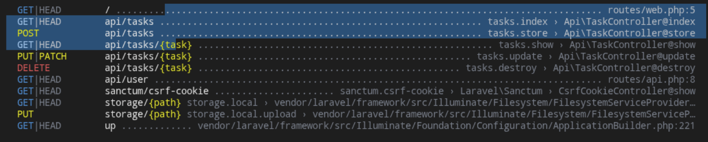

# todo-api

Простой REST API для управления задачами (To‑Do List) на PHP с использованием Laravel.

---

## Задача

Разработка простого API для управления задачами (To‑Do List):

**Требуется реализовать REST API для управления списком задач (To-Do List) на PHP с использованием Laravel.**

### Требования к реализации

1. Создать Laravel‑проект (если нет опыта с Laravel, можно на чистом PHP).
2. Реализовать API с CRUD‑операциями для задач:
   - Создание задачи: `POST /api/tasks` (поля: `title`, `description`, `status`).
   - Просмотр списка задач: `GET /api/tasks` (возвращает все задачи).
   - Просмотр одной задачи: `GET /api/tasks/{id}`.
   - Обновление задачи: `PUT /api/tasks/{id}`.
   - Удаление задачи: `DELETE /api/tasks/{id}`.
3. Валидация данных (например, `title` не должен быть пустым).
4. Использовать SQLite или MySQL в качестве базы данных.
5. Код должен быть загружен в GitHub / GitLab / Bitbucket.

---

## Быстрый старт

1. Установите зависимости:

   ```bash
   composer install
   ```

2. Настройте `.env` и запустите миграции:

   ```bash
   php artisan migrate
   ```

3. Запустите сервер:

   ```bash
   php artisan serve
   ```

API доступно по адресу `http://127.0.0.1:8000`.


## Подготовка базы данных

### MySQL / MariaDB

1. Запустите и настройте сервер MySQL / MariaDB.
2. Создайте базу данных и пользователя:

   ```sql
   CREATE DATABASE todo_api CHARACTER SET utf8mb4 COLLATE utf8mb4_unicode_ci;
   CREATE USER 'todo_user'@'localhost' IDENTIFIED BY 'ваш_пароль';
   GRANT ALL PRIVILEGES ON todo_api.* TO 'todo_user'@'localhost';
   FLUSH PRIVILEGES;
   ```
3. Настройте `.env`:

   ```env
   DB_CONNECTION=mysql
   DB_HOST=127.0.0.1
   DB_PORT=3306
   DB_DATABASE=todo_api
   DB_USERNAME=todo_user
   DB_PASSWORD=ваш_пароль
   ```
4. Выполните миграции:

   ```bash
   php artisan migrate
   ```

### Примеры API запросов

